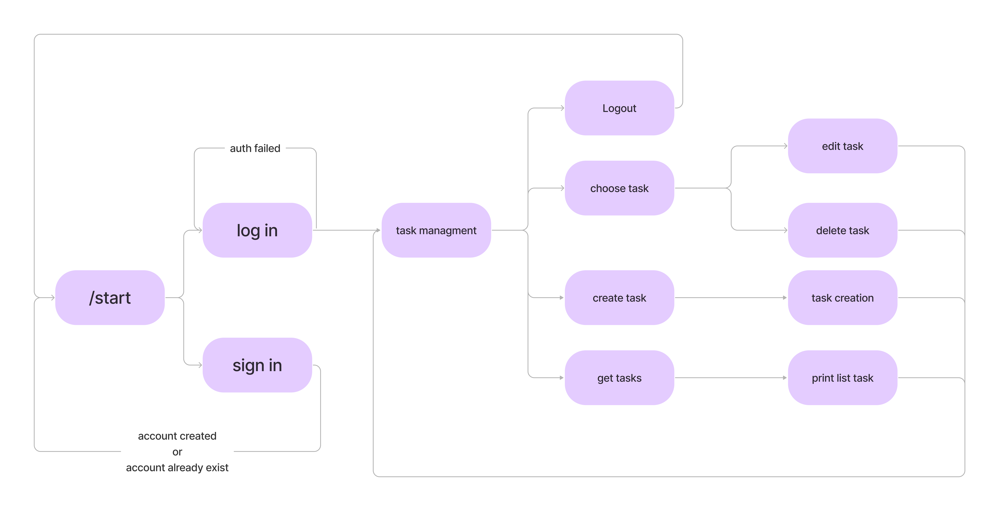

# Telegram-Task-Bot

It is a telegram bot that allows you to create accounts, tasks and manage tasks. It is built on the FSM principle.
This project uses `pyrogram` library, as well as `sqlalchemy` and `alembic` libraries to interact with the database.
The principle of operation can be seen in the following diagram. 

<p></p>

## DEPLOY

- Copy the project and change directory:
    ```
    git clone https://github.com/kalishevgeniy/Telegram-Task-Bot
    cd Telegram-Task-Bot
    ```
- Create `.env` file, add the database connection settings and telegram settings
- If the required migrations are missing in the database, they must be made:
    ```
    python3.10 -m venv .venv
    pip install -r requirements.txt        
    alembic upgrade head
    ```
- Create docker image:
    ```
    docker build . -t telegram_task_bot
    ```
- Run docker images:
    ```
    docker run telegram_task_bot
    ```
